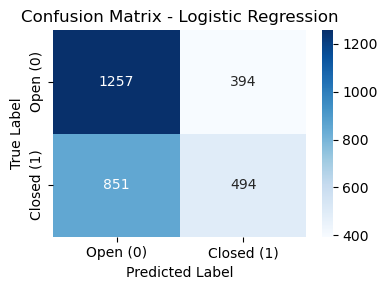
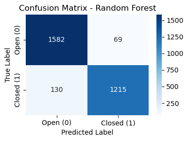
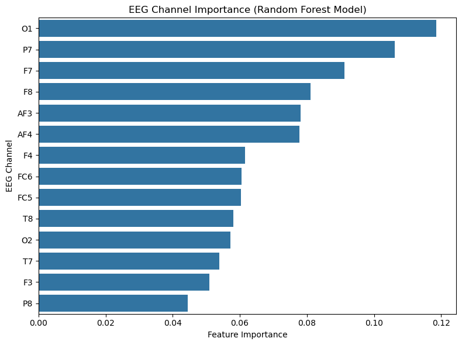

# EEG Eye State Classification (Eyes Open vs. Eyes Closed)

In this project, a machine learning pipeline is used to classify EEG eye state (eyes open vs. eyes closed) using a public dataset from the UCI Machine Learning Repository. The dataset includes EEG signals recorded from 14 channels with labels indicating whether the subject’s eyes were open or closed. I compare a baseline Logistic Regression model with a Random Forest model and interpret the most influential EEG channels using Random Forest feature importance.

## Project Goals

- Load and clean an EEG dataset (ARFF → pandas)
- Build an ML pipeline for binary classification
- Compare a baseline linear model vs. a random forest model for EEG data.
- Interpret which EEG channels contribute most to eyes open vs. eyes closed classification.

## Dataset

**Source:** UCI Machine Learning Repository — *EEG Eye State Dataset*  
https://archive.ics.uci.edu/ml/datasets/EEG+Eye+State
The dataset includes EEG recordings across multiple channels with a binary label indicating eye state.

- **Target label:** `eyeDetection`  
  - `0` = Eyes Open  
  - `1` = Eyes Closed  

> Note: In this repo, the dataset from UCI is placed in the `data/` folder.

## Methods

### Models
- **Baseline:** Logistic Regression (with standardized features)
- **Improved Model:** Random Forest (non-linear)

### Why Random Forest?
The baseline Logistic Regression model achieved a modest performance, meaning that the EEG patterns in this dataset are not strongly linearly separable. Random Forest performed significantly better in determining eye open vs. closed states.

## Results

### Logistic Regression (Baseline)
- **Accuracy:** ~0.58  
- **Recall (Eyes Closed):** ~0.37  
- **Recall (Eyes Open):** ~0.76



### Random Forest
- **Accuracy:** ~0.93  
- **Recall (Eyes Closed):** ~0.90  
- **Recall (Eyes Open):** ~0.96  



### Feature Importance (Random Forest)
Random Forest feature importance showed that posterior EEG channels were among the most influential EEG channels for distinguishing eyes-open vs. eyes-closed states.



## Conclusion
In this project, a Logistic Regression model and a Random Forest model were used to classify EEG eye state (eyes open vs. eyes closed). The Logistic Regression model performed with a 58% accuracy and struggled to detect eyes-closed (recall = 0.37). The Random Forest model had a 93% accuracy and a strong recall of 90% for eyes closed detection and 96% for eyes open detection. The feature importance analysis of the rRandom Forest model reported that the posterior EEG channels were among the most influential predictors for detecting eyes open vs. eyes closed states. This pattern is consistent with established neuroscience where the posterior regions of the brain are associated with vision and well-known eye-state patterns (e.g., the Berger effect)[^1].

## Project Structure

```text
eeg_eye_state_classification/
│
├── data/
│   └── EEG Eye State.arff
│
├── eeg_eye_state_classification_notebook.ipynb
│
├── images/
│   ├── confusion_matrix_random_forest.png
│   ├── confusion_matrix_logistic_regression.png
│   └── feature_importance_random_forest.png
│
├── environment.yml
└── README.md
```

## Author

**Amir Bagheri**  


## References
[^1]: van Dijk, H., Schoffelen, J.-M., Oostenveld, R., & Jensen, O. (2008). Prestimulus oscillatory activity in the alpha band predicts visual discrimination ability. Journal of Neuroscience, 28(8), 1816–1823.
